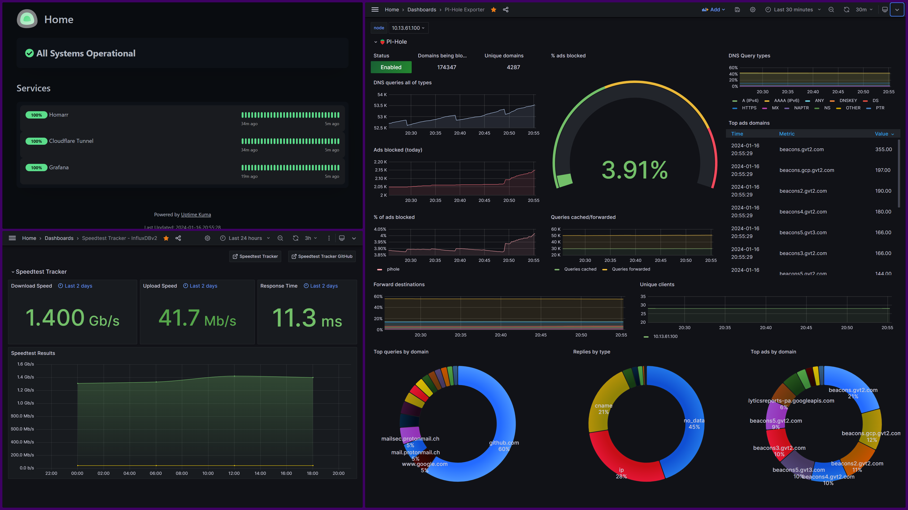

# simple-embed-dashboard
Simple website built to display 3 embedded websites. Some websites will have default configurations to not allow them to be embedded with iframes, which can be fixed depending on your hosted website. 

## Example

In the example, I have 2 Grafana dashboards (One monitoring pihole and the other internet speeds.) and Uptime Kuma. 

For Grafana, I needed to enable anonymous access and allow embedding in iframes. Then, I created a share link specifically for the dashboard I wanted. For Update Kuma, I also needed to disable iframe embed in the same origin only, with my setup. 
